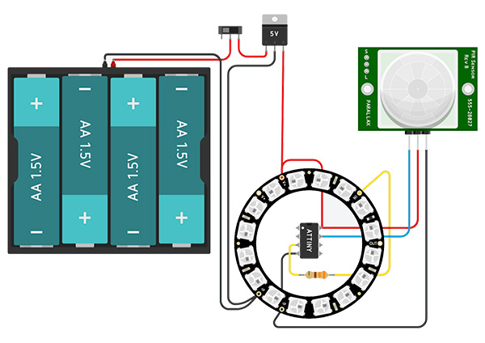
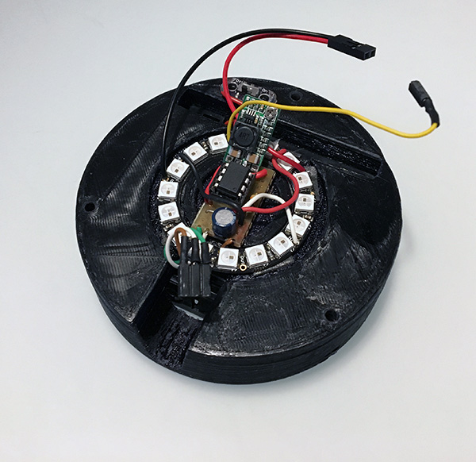
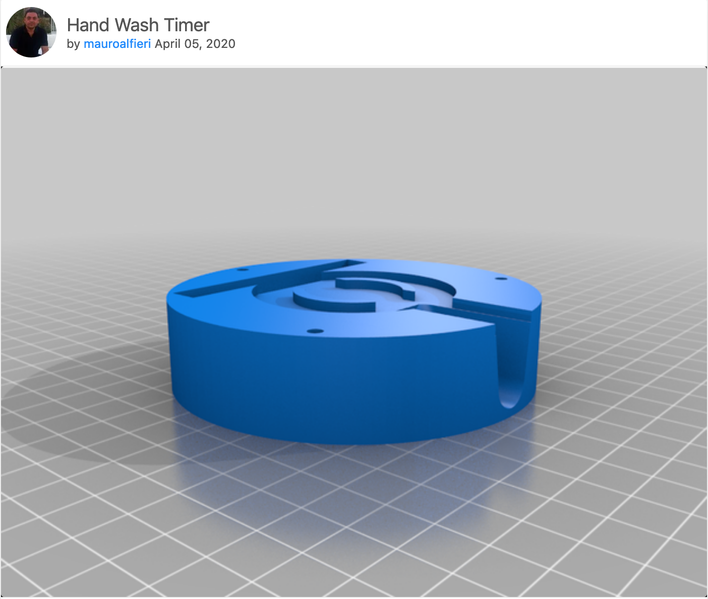
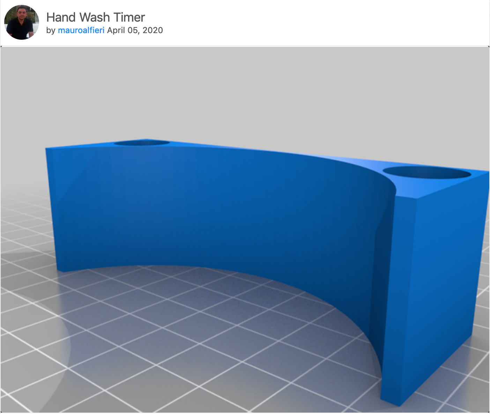

# HandWashTimer
The hand washing timer is a project with Attiny85, neopixel, pir sensor and 3D parts to create a useful counter time to wash your hands in covid-19 period and more.

In the last week I made my version of hand washing timer with:

- n.1 Attiny85
- n.1 Dc-Dc step down to 5v
- n.1 Neopixel ring 16
- n.1 mini pir sensor
- n.4 battery type AA ( 1,5v )
- n.1 battery holder for 4 AA batteries
- n.1 micro switch

### Electronic diagram

Here is the electronic diagram:

and this is an example wich how to mountit:

### 3D printed parts

The project consists of three parts:

- handWashTimer Base
- handWashTimer Cover
- handWashTimer Holder

#### handWashTimer Base

It's contain the battery holder fro 4 battery AA type, the electronics ( attiny85,dc-dc step down, neopixel ring and cables):

#### handWashTimer Cover

It's contain the mini pir sensor and power micro switch:

#### handWashTimer Holder

It's the support for the hand washing timer:

### ProjectFile

You can download the project files from this git repositories or from my think on https://www.thingiverse.com/thing:4262693